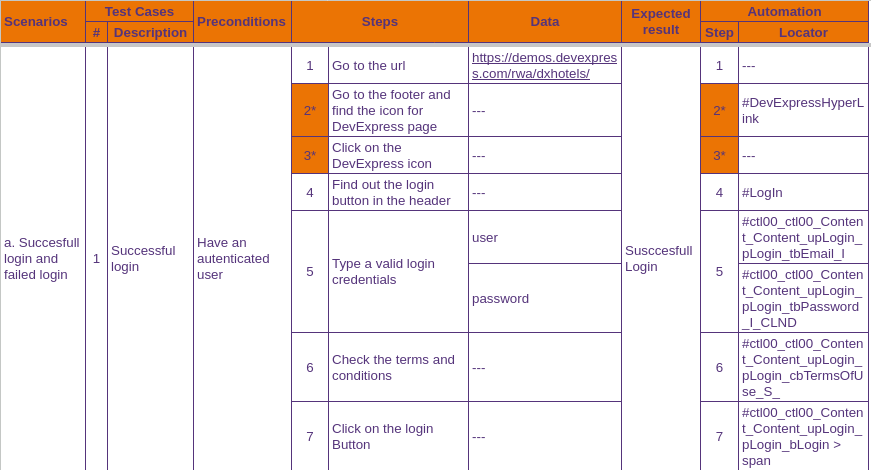
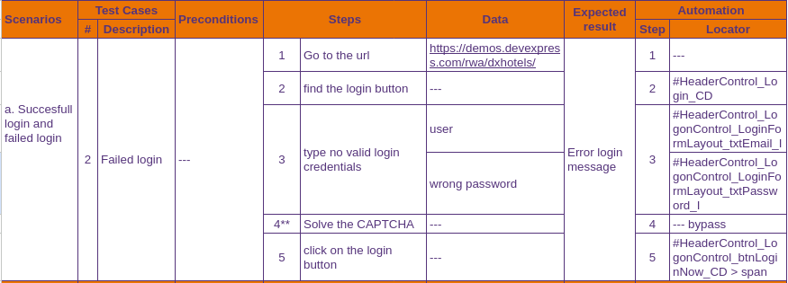
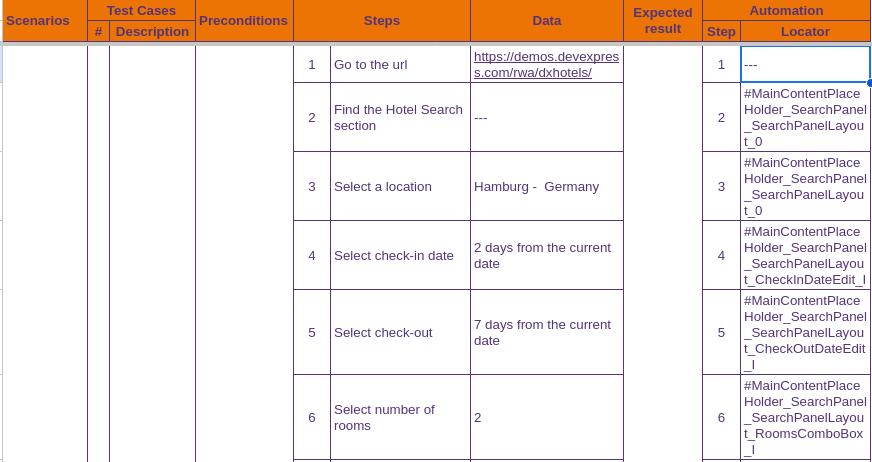
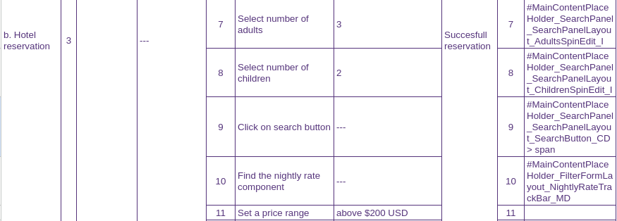

# Enerbit

**Reto técnico:** Automatizador de QA para enerBit

En este reto técnico, se requiere la automatización de pruebas utilizando las siguientes
herramientas y escenarios:

## Table of Contents

1. [Frontend](#1-frontend)  
1.1. [Test Cases](#11-test-cases)  
1.2. [Playwright project](#12-playwright-project)  
2. [Backend](#backend)  
2.2. [Karate.js project](#22-karatejs-project)  

## 1 Frontend

### DxHotel - Playwright TS

URL: https://demos.devexpress.com/rwa/dxhotels/

**Scenarios:**

a. Login exitoso y login fallido

b. Reservación de un hotel: Establecer los siguientes parámetros:
- Fecha de check-in: 2 días a partir de la fecha actual.
- Fecha de check-out: 7 días a partir de la fecha actual.
- Número de habitaciones: 2.
- Número de adultos: 3.
- Número de niños: 2.
- Rango de precio: superior a $200 USD.
- Número de estrellas: 3 o más.
- Aplicar los filtros seleccionados.
- Seleccionar el hotel más económico que cumpla con los filtros establecidos.

### 1.1 Test Cases

\*Login is not allowed for this demo. As a workarround to demosntrate login test, steps 2* and 3* have been included to redirect to an accessible login feature.
                                                             

\**In a real test environment, CAPTCHA is typically disabled. Although there are tools available to bypass it, these are not considered within the scope of the test. For this exercise, the CAPTCHA error message is treated as the login error message.

\**The test concludes here due to login restrictions on this demo site. However, if login were permitted, the test could proceed with test 1, indicating a successful login.

## 1.2 PlayWright Project

### Prerequisites

* node >= 16
* npm
* Playwright

### To install:

1. `Git Clone git@github.com:isabelyb/enerbit.git` To clone the repository in your local machine.
2. `npm i` To install dependecies.
3. `npx playwright install` To install Playwright.

### To run tests:

* `npx playwright test` Runs all tests.
* `npx playwright test login` Runs just the login test.
* `npx playwright test reservation` Runs just the reservation test.
* `npx playwright test --debug` Runs the tests in debug mode.

Note: The .env is shared in the repository to allow runs the project.

## Backend

### Back-end - Elección libre entre Karate.js y Python-Behave

Realizar la automatización de un servicio CRUD (Create, Read, Update, Delete).

## 2.2 Karate.js Project