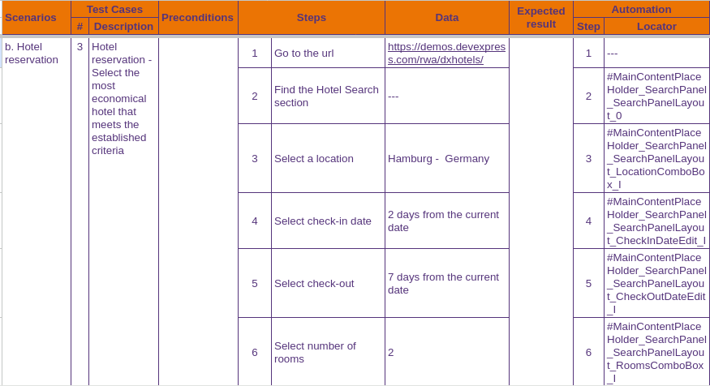

# Enerbit

**Reto técnico:** Automatizador de QA para enerBit

En este reto técnico, se requiere la automatización de pruebas utilizando las siguientes
herramientas y escenarios:

## Table of Contents

1. [Frontend](#1-frontend)  
1.1. [Test Cases](#11-test-cases)  
1.2. [Test Cases](#12-playwright-project)  
2. [Backend](#backend)  

## 1 Frontend

### DxHotel - Playwright TS

URL: https://demos.devexpress.com/rwa/dxhotels/

**Scenarios:**

a. Login exitoso y login fallido

b. Reservación de un hotel: Establecer los siguientes parámetros:
- Fecha de check-in: 2 días a partir de la fecha actual.
- Fecha de check-out: 7 días a partir de la fecha actual.
- Número de habitaciones: 2.
- Número de adultos: 3.
- Número de niños: 2.
- Rango de precio: superior a $200 USD.
- Número de estrellas: 3 o más.
- Aplicar los filtros seleccionados.
- Seleccionar el hotel más económico que cumpla con los filtros establecidos.

### 1.1 Test Cases

\*Login for this Demo isnot allowed for this demo. As a workarround to demosntrate login test, steps 2* and 3* have been included to redirect to an accessible login feature.
                                                             

\**The test concludes here due to login restrictions on this demo site. However, if login were permitted, the test could proceed with test 1, indicating a successful login   

## 1.2 PlayWright Project

Inside that directory, you can run several commands:

  npx playwright test
    Runs the end-to-end tests.

  npx playwright test --ui
    Starts the interactive UI mode.

  npx playwright test --project=chromium
    Runs the tests only on Desktop Chrome.

  npx playwright test example
    Runs the tests in a specific file.

  npx playwright test --debug
    Runs the tests in debug mode.

  npx playwright codegen
    Auto generate tests with Codegen.

We suggest that you begin by typing:

    npx playwright test

## Backend

### 2. Back-end - Elección libre entre Karate.js y Python-Behave

Realizar la automatización de un servicio CRUD (Create, Read, Update, Delete).